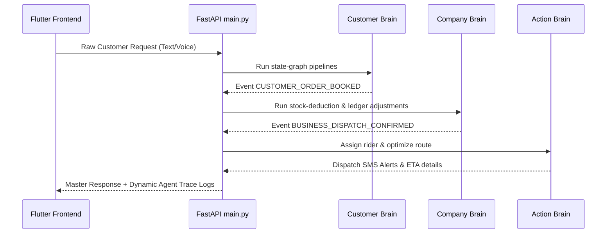

# File: README.md

## Purpose
Exhaustive master documentation explaining the entire Opsify architecture, end-to-end integration, event schemas, chronological sprint roadmaps, and Flutter frontend implementation.

## Responsibility
Serve as the centralized entry point and blueprint for the whole Opsify platform.

## Inputs
Technical parameters of all three modular brain systems.

## Outputs
Repository guidelines, styling definitions, terminal widget blueprints, and master API loops.

## Dependencies
- SYSTEM_1_CUSTOMER_BRAIN.md
- SYSTEM_2_COMPANY_BRAIN.md
- SYSTEM_3_ACTION_BRAIN.md

## Notes
Follows premium dark UI visual guidelines and clean architecture standards.

---

# 🚀 Opsify Master Architecture & Integration Specification

Opsify is an advanced, AI-native orchestrator built on a Blackboard/State-Graph (Antigravity) architecture designed to manage the informal economy 24/7.

---

## 🏗️ 1. Decoupled Systems Overview

Opsify is divided into 3 independent, highly specialized "Brains":

*   **1. [Customer Brain](file:///e:/projects/Opsify/SYSTEM_1_CUSTOMER_BRAIN.md):** Ingests raw multi-lingual customer requests (text/voice), parses intents, and simulates reservations.
*   **2. [Company Brain](file:///e:/projects/Opsify/SYSTEM_2_COMPANY_BRAIN.md):** Monitors stock limits, auto-replenishes commodities using wholesaler price bidding comparisons, and updates ledgers.
*   **3. [Action Brain](file:///e:/projects/Opsify/SYSTEM_3_ACTION_BRAIN.md):** Allocates nearest regional riders, optimizes geolocations, and triggers notification alerts.

---

## 🔄 2. End-to-End Master Event Integration Loop

Each system runs completely decoupled. The master API server (`main.py`) orchestrates them sequentially using structured JSON event contracts (Rule 7 compliant formats):



---

## 📆 3. Master Chronological Implementation Plan

Follow this sprint timeline checklist to execute the complete platform:

*   [ ] **1. Scaffolding (Today):** Run python graph pipeline verifications: `python test_graph.py`.
*   [ ] **2. System 2 Company Brain Scaffolds (Days 1-2):** Code the `company_brain` directory and run isolated mock test cycles: `python test_company.py`.
*   [ ] **3. System 3 Action Brain Scaffolds (Days 3-4):** Code `action_brain` directory and verify simulated rider dispatches: `python test_action.py`.
*   [ ] **4. Master Stitch Integration (Day 5):** Sequence all three graphs into a combined API route `/api/orchestrate/master` in `main.py`.
*   [ ] **5. Live API Upgrades (Days 6-8):** Connect Supabase databases, active geolocation maps, and live LLM prompt pipelines.
*   [ ] **6. Flutter Client Integration (Days 9-10):** Link client screens to view live monospaced terminal thought traces.

---

## 📱 4. Flutter Premium Application Blueprint

Ensure the mobile app delivers a visual premium dark glassmorphic styling.

### 🎨 4.1 Immersive HSL Color Styling
*   Scaffold Dark Backdrops: `#0F111A`
*   Glass Card overlays: `#1E2235` (borders `#2E3450`, width 1.5)
*   Neon green highlight CLI: `#00FF88`
*   Primary Action Blue: `#00D2FF`

### 📟 4.2 Dynamic Auto-Scrolling Trace Terminal Widget
Keep the trace console lively! Implement this scroll controller that auto-scrolls down when logs arrive:

```dart
class _TraceTerminalWidgetState extends State<TraceTerminalWidget> {
  final ScrollController _scrollController = ScrollController();

  @override
  void didUpdateWidget(covariant TraceTerminalWidget oldWidget) {
    super.didUpdateWidget(oldWidget);
    WidgetsBinding.instance.addPostFrameCallback((_) {
      if (_scrollController.hasClients) {
        _scrollController.animateTo(
          _scrollController.position.maxScrollExtent,
          duration: const Duration(milliseconds: 300),
          curve: Curves.easeOut,
        );
      }
    });
  }

  @override
  Widget build(BuildContext context) {
    return Container(
      height: 250,
      decoration: BoxDecoration(
        color: Color(0xFF05070B),
        borderRadius: BorderRadius.circular(12),
        border: Border.all(color: Color(0xFF1B2F25), width: 1.5),
      ),
      padding: EdgeInsets.all(12),
      child: ListView.builder(
        controller: _scrollController,
        itemCount: widget.logs.length,
        itemBuilder: (context, index) {
          return Text(
            widget.logs[index],
            style: TextStyle(color: Color(0xFF00FF88), fontFamily: 'monospace', fontSize: 12),
          );
        },
      ),
    );
  }
}
```

### 🎤 4.3 Multipart Audio API Upload Client
Record raw audio messages and dispatch them as binary multi-part requests to FastAPI:

```dart
Future<Map<String, dynamic>> uploadAudioOrder(String filepath) async {
  final uri = Uri.parse('http://127.0.0.1:8000/api/orchestrate/audio');
  final request = http.MultipartRequest('POST', uri);
  request.files.add(await http.MultipartFile.fromPath('file', filepath));
  
  final response = await request.send();
  if (response.statusCode == 200) {
    final responseBody = await response.stream.bytesToString();
    return jsonDecode(responseBody);
  } else {
    throw Exception('Audio upload failed');
  }
}
```
