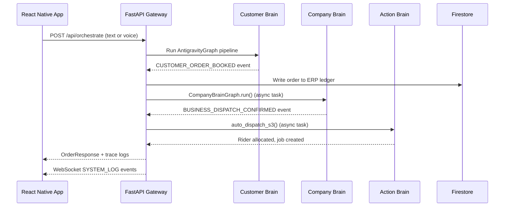

# 🚀 Opsify — AI-Native Business Operations Platform

> **Opsify** is a production-grade, AI-native ERP and logistics orchestration platform built for the informal economy. It pairs a **FastAPI Python backend** (multi-agent AI orchestrator) with a **React Native / Expo mobile app** to automate order intake, inventory management, procurement, logistics dispatch, and real-time delivery tracking — all powered by Google Gemini AI.

---

## 📑 Table of Contents

1. [Architecture Overview](#architecture-overview)
2. [Repository Structure](#repository-structure)
3. [Backend — FastAPI Server](#backend--fastapi-server)
   - [Entry Point: main.py](#entry-point-mainpy)
   - [Event Broker](#event-broker)
   - [System 1 — Customer Brain](#system-1--customer-brain)
   - [System 2 — Company Brain](#system-2--company-brain)
   - [System 3 — Action Brain](#system-3--action-brain)
   - [AI Agents](#ai-agents)
   - [API Routers](#api-routers)
   - [Tools & Database](#tools--database)
4. [Mobile App — React Native / Expo](#mobile-app--react-native--expo)
   - [App Entry & Navigation](#app-entry--navigation)
   - [Screens](#screens)
   - [Services & API Layer](#services--api-layer)
   - [Components & Widgets](#components--widgets)
5. [Complete API Reference](#complete-api-reference)
6. [Environment Variables](#environment-variables)
7. [Setup & Running](#setup--running)
8. [Data Flow Diagrams](#data-flow-diagrams)
9. [Technology Stack](#technology-stack)

---

## Architecture Overview

Opsify is built on a **Blackboard / State-Graph (Antigravity)** architecture where three fully decoupled AI "Brains" process events sequentially via a central message broker:

```
┌─────────────────────────────────────────────────────────────────────┐
│                         Opsify Platform                             │
│                                                                     │
│  ┌───────────────┐   Events   ┌────────────────┐   Events          │
│  │  Customer     │──────────► │  Company Brain │──────────────►    │
│  │  Brain (S1)   │            │  (S2 — ERP)    │  ┌─────────────┐  │
│  │               │            │                │  │ Action Brain│  │
│  │ NLP/Voice     │            │ Inventory      │  │ (S3 — Ops)  │  │
│  │ Intent Agent  │            │ Procurement    │  │ Routing     │  │
│  │ Chat Scanner  │            │ Ledger         │  │ Dispatch    │  │
│  └───────────────┘            └────────────────┘  └─────────────┘  │
│                                                                     │
│  ┌─────────────────────────────────────────────────────────────┐   │
│  │              FastAPI main.py — Orchestrator Gateway          │   │
│  │       WebSocket Event Broker · API Key Auth · CORS          │   │
│  └─────────────────────────────────────────────────────────────┘   │
│                                                                     │
│  ┌─────────────────────────────────────────────────────────────┐   │
│  │          React Native / Expo Mobile App (TypeScript)         │   │
│  │  Brain · ERP Hub · OmniChat · Delivery · OpsBot · Agent     │   │
│  └─────────────────────────────────────────────────────────────┘   │
└─────────────────────────────────────────────────────────────────────┘
```

### Master Event Loop



---

## Repository Structure

```
Opsify/
├── main.py                         # FastAPI app entry point
├── requirements.txt                # Python dependencies
├── Procfile                        # Heroku/Cloud Run process definition
├── app.yaml                        # GCP App Engine config
├── deploy.ps1                      # PowerShell deployment script
├── Deploy.md                       # Deployment documentation
├── RUNNING.md                      # Local run instructions
├── REPO_MAP.md                     # Repository map
├── firebase-adminsdk.json          # Firebase Admin SDK credentials
├── firebase_store.py               # Firestore client helpers
├── .env / .env.example             # Environment variables
│
├── broker/
│   └── event_broker.py             # In-memory WebSocket event bus
│
├── orchestrator/
│   ├── graph.py                    # AntigravityGraph — Customer Brain graph
│   └── state.py                    # OpsifyState TypedDict schema
│
├── agents/
│   ├── intent_agent.py             # Gemini NLP intent extraction
│   ├── chat_agent.py               # OpsBot ERP assistant (Gemini function calling)
│   ├── chat_scan_agent.py          # Deep chat scanner (Firestore scan state)
│   ├── agri_agent.py               # Agri-Bridge logistics agent
│   ├── bidding_agent.py            # Supplier procurement bidding engine
│   ├── matching_agent.py           # Provider matching agent
│   ├── ranking_agent.py            # Provider ranking agent
│   └── simulation_agent.py         # Order simulation/booking agent
│
├── company_brain/
│   ├── inventory.py                # SQLite ERP inventory (legacy)
│   ├── firestore_inventory.py      # Firestore ERP inventory (production)
│   ├── graph.py                    # CompanyBrainGraph — S2 pipeline
│   ├── notifications.py            # Expo push notifications + Firestore records
│   └── ops_chat.py                 # OmniChat Firestore helpers
│
├── action_brain/
│   ├── riders.py                   # Rider registry & allocation
│   ├── geo.py                      # OSRM / Haversine geolocation engine
│   ├── state_machine.py            # Job lifecycle state machine (Firestore)
│   ├── db.py                       # SQLite action brain (legacy)
│   └── firestore_db.py             # Firestore action brain (production)
│
├── routers/
│   ├── orchestrator.py             # System 1 routes: /api/orchestrate, scan, voice
│   ├── company.py                  # System 2 routes: ERP CRUD, analytics, chat
│   ├── action.py                   # System 3 routes: dispatch, jobs, riders
│   └── agri.py                     # Agri routes: demand feed, shared logistics
│
├── tools/
│   ├── database.py                 # Provider registry (33 providers, 9 zones)
│   └── booking.py                  # Booking simulation helper
│
├── tests/
│   ├── conftest.py
│   ├── test_api_crud.py
│   ├── test_company_brain.py
│   ├── test_forecast.py
│   ├── test_graph.py
│   ├── test_inventory.py
│   └── test_provider_search.py
│
└── react_native_app/
    ├── App.tsx                     # Root app, navigation, auth, tabs
    ├── src/
    │   ├── core/
    │   │   ├── theme.ts            # Design system (colors, spacing, animations)
    │   │   └── AppDataContext.tsx  # Global shared data context
    │   ├── screens/
    │   │   ├── CustomerBrainScreen.tsx      # System 1 — Chat scanner & order approval
    │   │   ├── InventoryDashboardScreen.tsx # System 2 — ERP Hub
    │   │   ├── ERPAgentScreen.tsx           # System 2 — ERP Intelligence Agent
    │   │   ├── ChatScreen.tsx               # OpsBot AI assistant
    │   │   ├── DeliveryIntelligenceScreen.tsx # Agri-Bridge logistics
    │   │   ├── LogisticsScreen.tsx          # System 3 — Delivery Command Center
    │   │   ├── OmniChat/
    │   │   │   ├── OmniChatScreen.tsx       # Chat list navigator
    │   │   │   ├── ChatListScreen.tsx       # All conversations list
    │   │   │   └── ChatRoomScreen.tsx       # Individual chat room
    │   │   ├── AuthScreen.tsx               # Firebase Auth login/register
    │   │   ├── OnboardingScreen.tsx         # First-time user onboarding
    │   │   ├── AccountSettingsScreen.tsx    # Profile & account settings
    │   │   └── NotificationsScreen.tsx      # Push notification history
    │   ├── services/
    │   │   ├── api.ts                       # Full REST API client (ApiService)
    │   │   ├── firebaseChatService.ts       # Firestore realtime chat
    │   │   └── NotificationService.ts       # Expo push token registration
    │   ├── components/
    │   │   ├── ErrorBoundary.tsx            # React error boundary
    │   │   └── inventory/
    │   │       ├── ActivityLogViewer.tsx    # ERP activity log
    │   │       ├── OrderManager.tsx         # Order CRUD management
    │   │       ├── OverviewDashboard.tsx    # KPI overview
    │   │       ├── PredictiveDashboard.tsx  # Demand forecasting UI
    │   │       ├── ProcurementApproval.tsx  # AI procurement approvals
    │   │       ├── ProductManager.tsx       # Product catalog CRUD
    │   │       ├── SalesManager.tsx         # Sales recording
    │   │       ├── SupplierManager.tsx      # Supplier network management
    │   │       ├── TransactionManager.tsx   # Transaction history
    │   │       └── WarehouseManager.tsx     # Warehouse management
    │   ├── config/
    │   │   └── firebaseConfig.ts            # Firebase client SDK config
    │   └── widgets/
    │       └── TraceTerminal.tsx            # Live AI trace terminal widget
```

---

## Backend — FastAPI Server

### Entry Point: `main.py`

The FastAPI application bootstraps the entire platform:

| Feature | Detail |
|---|---|
| **Title** | `Opsify AI Orchestrator API v2.0.0` |
| **Database Init** | Calls `init_db()` from `company_brain.firestore_inventory` on startup |
| **CORS** | Open (`*`) — all origins, methods, and headers allowed |
| **API Key Auth** | `X-API-Key` header validation middleware (configurable via `OPSIFY_API_KEY` env var) |
| **Public Paths** | `/`, `/docs`, `/redoc`, `/openapi.json`, `/ws/events`, `/api/map/render`, `/api/petrol/price`, `/api/export/csv` |
| **WebSocket** | `/ws/events` — real-time system log streaming to frontend |
| **Event Publishing** | `POST /api/events/publish` — publishes any event and triggers autonomous listeners |
| **Auto S2→S3 Chain** | When `BUSINESS_DISPATCH_CONFIRMED` is published with `dispatch_status=READY`, automatically triggers `auto_dispatch_s3()` |

**Autonomous Event Listeners:**
- `CUSTOMER_ORDER_BOOKED` → spawns `CompanyBrainGraph.run()` as async background task
- `BUSINESS_DISPATCH_CONFIRMED` (READY) → calls `auto_dispatch_s3()` to allocate rider

---

### Event Broker

**File:** `broker/event_broker.py`

An in-memory WebSocket broadcast hub. All connected frontend clients receive real-time `SYSTEM_LOG` events as agents process orders.

```python
# Event structure published to all WebSocket clients
{
    "event_type": "SYSTEM_LOG",
    "source": "ActionBrain",
    "payload": {"message": "Rider Ali dispatched..."},
    "timestamp": "ISO-8601"
}
```

---

### System 1 — Customer Brain

**Purpose:** Converts raw customer messages (text or voice) into structured ERP orders via a sequential state-graph pipeline.

#### `orchestrator/state.py` — OpsifyState Schema

```python
class OpsifyState(TypedDict):
    raw_input: str               # Raw customer message
    extracted_intent: Dict       # {category, location, time, quantity, urgency_level}
    candidate_providers: List    # Matched service providers
    selected_provider: Dict      # Highest-ranked provider
    agent_trace_logs: List[str]  # Live AI thought logs for frontend terminal
    execution_status: str        # PENDING → PARSED → MATCHED → BOOKED / FAILED
```

#### `orchestrator/graph.py` — AntigravityGraph

The sequential Blackboard graph pipeline:
1. **Linguistic Intent Node** → Gemini 2.5 Flash Lite parses multilingual input (English/Urdu/Roman Urdu) into structured intent JSON
2. **Matching Node** → Queries the 33-provider database with zone-aware adjacency fallback
3. **Ranking Node** → Scores providers by rating and price, generates AI reasoning string
4. **Simulation Node** → Books the provider, emits `CUSTOMER_ORDER_BOOKED` event

#### `agents/intent_agent.py` — Linguistic Intent Agent

| Mode | Behavior |
|---|---|
| **Gemini (Primary)** | Calls `gemini-2.5-flash-lite` with a structured JSON extraction prompt |
| **Heuristic Fallback** | Keyword matching for Urdu/English categories, locations, quantities, urgency |

**Extracted Fields:**
- `category`: `Electrician`, `Plumber`, `AC Technician`, `Milk`, `Unknown`
- `location`: `Gulshan`, `DHA`, `Clifton`, `Unknown`
- `time`: `ASAP`, `Today`, `Tomorrow`
- `quantity`: e.g. `2kg`, `50 meters`
- `urgency_level`: `HIGH` / `MEDIUM`

#### `agents/chat_scan_agent.py` — Deep Chat Scanner

The most sophisticated agent in the system. Scans all Firebase OmniChat messages to detect unbooked business orders.

**Core Features:**
- **Incremental Scanning:** Maintains per-chat cursors in Firestore (`scan_state` subcollection) — only new messages since last scan are processed
- **Gemini AI Detection:** Uses `gemini-2.5-flash-lite` to find SALE/RESTOCK/ADJUSTMENT intents in conversation blocks
- **Heuristic Fallback:** Keyword-based scanner for when Gemini API is unavailable
- **Order Persistence:** Detected orders saved to `pending_scan_orders` Firestore subcollection with MD5 fingerprints
- **Deduplication:** Orders rejected by the user are stored in `__rejected__` document and never resurfaced
- **Scan Sessions:** Every scan run is logged to `scan_sessions` collection for audit history

**Firestore Collections Used:**
| Collection | Purpose |
|---|---|
| `users/{uid}/scan_state/{chat_id}` | Per-chat scan cursor (last message ID + timestamp) |
| `users/{uid}/scan_state/__rejected__` | Fingerprints of rejected orders |
| `users/{uid}/pending_scan_orders/{fp}` | Pending orders awaiting approval/rejection |
| `users/{uid}/scan_sessions` | Historical scan session records |

---

### System 2 — Company Brain

**Purpose:** Digital business operations engine — manages inventory, handles procurement, records financial transactions, and generates AI-powered analytics.

#### `company_brain/firestore_inventory.py` — Firestore ERP Backend

Per-user Firestore document structure. Every user gets their own isolated data namespace.

**Collections per user:**
| Collection | Schema |
|---|---|
| `warehouses` | `{id, name, location, capacity}` |
| `suppliers` | `{id, name, contact, rating, reliability_score, lead_time_days}` |
| `products` | `{id, sku, name, category, variant, unit, cost_price, selling_price, stock, reorder_threshold, supplier_id, warehouse_id}` |
| `transactions` | `{id, product_id, warehouse_id, type, reason, quantity, total_value, timestamp}` |
| `orders` | `{id, order_ref, customer_name, product_id, warehouse_id, quantity, unit_price, total_value, status, created_at}` |
| `activity_log` | `{id, action, details, timestamp}` |
| `notifications` | `{id, title, body, type, read, created_at}` |

**Key Analytics Functions:**
- **`get_demand_predictions()`** — Single Exponential Smoothing (SES, alpha=0.4) on 13 weekly buckets of last 90 days of sales. Returns daily velocity, trend direction (UP/DOWN/STABLE), confidence level, and estimated stock-out date.
- **`get_reorder_suggestions()`** — Products below reorder threshold, with lead-time demand calculation and 20% safety buffer. Urgency ladder: CRITICAL → HIGH → MEDIUM.
- **`get_profit_summary()`** — Per-product revenue, cost, profit margin, and a portfolio-level summary.

#### `company_brain/notifications.py` — Push Notification System

- Sends Expo push notifications via `https://exp.host/--/api/v2/push/send`
- Every notification is also persisted to Firestore `notifications` collection as a readable history record
- Notification types auto-inferred from title: `supplier`, `order`, `stock`, `alert`, `procurement`, `system`
- Async wrapper (`send_push_notification_async`) for non-blocking event loop

#### `company_brain/graph.py` — CompanyBrainGraph

Processes `CUSTOMER_ORDER_BOOKED` events:
1. Checks inventory stock levels
2. If stock low → triggers procurement workflow
3. Updates ledger with sale transaction
4. Emits `BUSINESS_DISPATCH_CONFIRMED` event

---

### System 3 — Action Brain

**Purpose:** Translates confirmed business dispatches into real-world logistics — allocating riders, computing optimal routes, and tracking jobs through a 5-state lifecycle.

#### `action_brain/geo.py` — Geolocation Engine

| Feature | Detail |
|---|---|
| **Primary Routing** | OSRM public API (`http://router.project-osrm.org`) — real road-network distances and travel times |
| **Fallback** | Haversine great-circle distance with 1.35× urban road factor |
| **Depots** | Gulshan Depot (24.9242, 67.0873), DHA/Clifton Depot (24.8138, 67.0366), Saddar Central Hub (24.8607, 67.0104) |
| **Zone Coverage** | 13 Karachi zones mapped to GPS coordinates |
| **Nearest Depot** | Automatically finds closest depot for any destination GPS |

#### `action_brain/riders.py` — Rider Registry & Allocation

- Maintains a registry of available riders with vehicle type, rating, phone, and zone
- `allocate_rider(destination)` computes OSRM ETAs from each rider's depot to the destination and selects the fastest available rider
- Riders marked `BUSY` during job, returned to `AVAILABLE` on `JOB_COMPLETED`

#### `action_brain/state_machine.py` — Job Lifecycle

5-state Firestore-persisted job machine:

```
DISPATCHED → EN_ROUTE → ARRIVED → JOB_STARTED → JOB_COMPLETED
```

Each state transition is timestamped in a `timeline` array. Jobs survive server restarts (Firestore-backed).

**Job Schema:**
```json
{
  "job_id": "JOB-ABC123",
  "order_id": "ORD-1234",
  "rider_id": "rider_1",
  "rider_name": "Ali Hassan",
  "rider_phone": "+92-300-1234567",
  "rider_vehicle": "Motorcycle",
  "rider_rating": 4.8,
  "destination_zone": "Clifton",
  "item": "Milk",
  "customer_name": "Ahmed Khan",
  "customer_phone": "+92-300-8271039",
  "route": {"distance_km": 4.2, "eta_minutes": 12.3, "source": "OSRM (Live Road Network)"},
  "status": "EN_ROUTE",
  "status_index": 1,
  "timeline": [{"state": "DISPATCHED", "timestamp": "..."}, {"state": "EN_ROUTE", "timestamp": "..."}],
  "created_at": "...",
  "updated_at": "..."
}
```

---

### AI Agents

#### `agents/chat_agent.py` — OpsBot ERP Assistant

Gemini-powered conversational assistant with full function-calling capability and live database access.

**Available Tools (Gemini Function Declarations):**
| Tool | Description |
|---|---|
| `tool_get_stock_levels` | Current stock levels across all warehouses |
| `tool_get_recent_orders` | Recent transactions (sales, restocks, adjustments) |
| `tool_get_suppliers` | Full supplier list with ratings |
| `tool_get_warehouses` | All warehouse information |
| `tool_find_suppliers_nearby` | Google Maps Places API search for nearby suppliers |
| `tool_stage_restock` | Stage a restock (returns ActionCard for UI confirmation) |
| `tool_stage_sale` | Stage a sale reduction (returns ActionCard) |
| `tool_stage_adjustment` | Stage a stock adjustment (returns ActionCard) |

**Model Priority Chain (configurable via `GEMINI_MODEL_PRIORITY` env):**
1. `gemini-2.5-flash-lite` (default first)
2. `gemini-2.5-flash`
3. `gemma-4-26b`
4. `gemma-4-31b`

With per-model retry logic on quota exhaustion (reads `retryDelay` from API error messages).

**ActionCard Pattern:** Staging tools never execute irreversibly — they return a JSON payload the frontend displays as a confirmation card before the user approves.

#### `agents/bidding_agent.py` — Supplier Procurement Engine

Finds nearby wholesale suppliers for a given product using a 3-tier fallback:
1. **Google Maps Places API** — real nearby business results
2. **OpenStreetMap Nominatim** — free geocoding fallback
3. **Mock data generator** — deterministic seed-based results for demos

Sorted by reliability score and lead time days.

#### `agents/agri_agent.py` — Agri-Bridge Agent

Simulates the hyperlocal agricultural supply chain:
- Generates 50 simulated WhatsApp messages from street vendors within a 5km Karachi radius
- Aggregates crop demand (Organic Tomatoes, Sindhri Mangoes, Red Onions, Fresh Potatoes, Spinach)
- Calculates shared logistics routing: 50 individual trips (300km) → 1 shared route (34.8km)
- Generates per-vendor e-invoices showing ~20% profit margin improvement from shared logistics

---

### API Routers

#### `routers/orchestrator.py` — System 1 Routes

| Method | Endpoint | Description |
|---|---|---|
| `POST` | `/api/orchestrate` | Run Customer Brain pipeline on text message |
| `POST` | `/api/voice/transcribe` | Gemini multimodal audio transcription (base64) |
| `GET` | `/api/providers` | List all 33 service providers |
| `GET` | `/api/providers/search` | Zone-aware provider search with adjacency fallback |
| `GET` | `/api/providers/categories` | All service categories |
| `POST` | `/api/agents/scan-chats` | Legacy chat scanner |
| `POST` | `/api/agents/deep-scan` | Deep incremental chat scan with Firestore cursors |
| `GET` | `/api/agents/pending-orders` | Load all pending detected orders from Firestore |
| `DELETE` | `/api/agents/pending-orders/{fp}` | Remove a pending order by fingerprint |
| `PUT` | `/api/agents/pending-orders/{fp}` | Update a pending order before booking |
| `GET` | `/api/agents/scan-state` | Return scan cursors + recent sessions |
| `POST` | `/api/agents/reject-order` | Mark an order as permanently rejected |
| `DELETE` | `/api/agents/scan-sessions/{id}` | Delete a scan session record |
| `DELETE` | `/api/agents/scan-sessions` | Clear all scan history |
| `DELETE` | `/api/agents/scan-cursors/{chat_id}` | Reset a single chat cursor |
| `DELETE` | `/api/agents/scan-cursors` | Reset all cursors (force full re-scan) |

#### `routers/company.py` — System 2 ERP Routes

All endpoints accept `X-User-ID` header for per-user data scoping.

**Warehouses:**
| Method | Endpoint | Description |
|---|---|---|
| `GET` | `/api/warehouses` | List all warehouses |
| `POST` | `/api/warehouses/add` | Create a new warehouse |
| `PUT` | `/api/warehouses/{id}` | Update warehouse details |
| `DELETE` | `/api/warehouses/{id}` | Delete a warehouse |

**Suppliers:**
| Method | Endpoint | Description |
|---|---|---|
| `GET` | `/api/suppliers` | List all suppliers |
| `POST` | `/api/suppliers` | Add a supplier (triggers push notification) |
| `PUT` | `/api/suppliers/{id}` | Update supplier (triggers push notification) |
| `DELETE` | `/api/suppliers/{id}` | Remove supplier (triggers push notification) |
| `DELETE` | `/api/suppliers/all` | Bulk delete all suppliers |

**Products:**
| Method | Endpoint | Description |
|---|---|---|
| `GET` | `/api/products` | List all products (with stock + supplier info) |
| `POST` | `/api/products/add` | Add a product with initial stock |
| `PUT` | `/api/products/{id}` | Update product details or stock level |
| `DELETE` | `/api/products/{id}` | Delete a product |

**Transactions:**
| Method | Endpoint | Description |
|---|---|---|
| `GET` | `/api/transactions` | Full transaction history |
| `POST` | `/api/transactions/sale` | Record a sale (reduces stock) |
| `POST` | `/api/transactions/restock` | Record a restock (increases stock) |
| `POST` | `/api/transactions/adjustment` | Record a stock adjustment with reason |

**Analytics:**
| Method | Endpoint | Description |
|---|---|---|
| `GET` | `/api/inventory/predictions` | SES demand forecasting per product |
| `GET` | `/api/inventory/suggestions` | AI reorder suggestions (CRITICAL/HIGH/MEDIUM urgency) |
| `GET` | `/api/analytics/profit` | Profit summary (revenue, cost, margin, per-product breakdown) |

**Orders:**
| Method | Endpoint | Description |
|---|---|---|
| `GET` | `/api/orders` | List all customer orders |
| `POST` | `/api/orders/add` | Create a new order |
| `PUT` | `/api/orders/{id}/status` | Update order status |
| `POST` | `/api/orders/{id}/dispatch` | Dispatch an order (assign courier) |
| `DELETE` | `/api/orders/{id}` | Delete an order |

**Procurement:**
| Method | Endpoint | Description |
|---|---|---|
| `POST` | `/api/procurement/suggest` | Get nearby supplier suggestions (Google Maps/OSM/Mock) |
| `POST` | `/api/procurement/approve` | Approve procurement — adds supplier, records restock |

**OpsBot Chat:**
| Method | Endpoint | Description |
|---|---|---|
| `POST` | `/api/chat` | Send a message to the Gemini ERP assistant |

**User & Notifications:**
| Method | Endpoint | Description |
|---|---|---|
| `GET` | `/api/users/onboarding` | Check if user has been onboarded |
| `POST` | `/api/users/push-token` | Register Expo push notification token |
| `POST` | `/api/users/test-push` | Send a test push notification |
| `GET` | `/api/users/notifications` | Load notification history |
| `PATCH` | `/api/users/notifications/{id}/read` | Mark notification as read |
| `POST` | `/api/users/notifications/mark-all-read` | Mark all notifications as read |
| `POST` | `/api/onboarding/seed` | Seed demo data for new user |
| `POST` | `/api/onboarding/init` | Initialize empty workspace |
| `POST` | `/api/onboarding/reseed` | Re-seed demo data (from Settings) |

**Other:**
| Method | Endpoint | Description |
|---|---|---|
| `GET` | `/api/vendors/search` | Search nearby vendors (Google Maps/OSM/Mock) |
| `GET` | `/api/export/csv` | Export full ledger as CSV (inventory + transactions + suppliers) |
| `GET` | `/api/activity-log` | Full activity log (last N entries) |

#### `routers/action.py` — System 3 Logistics Routes

| Method | Endpoint | Description |
|---|---|---|
| `GET` | `/api/action/zones` | List all zone names with GPS coordinates |
| `GET` | `/api/action/depots` | List all depot hubs |
| `POST` | `/api/action/route` | Compute OSRM/Haversine route between two GPS points |
| `GET` | `/api/action/nearest-depot` | Find nearest depot to given GPS |
| `GET` | `/api/action/riders` | List all registered riders |
| `POST` | `/api/action/dispatch` | Full dispatch pipeline: allocate rider + create job |
| `POST` | `/api/action/jobs/{id}/advance` | Advance job to next state |
| `GET` | `/api/action/jobs/{id}` | Get specific job details |
| `GET` | `/api/action/jobs` | List all active dispatch jobs |

---

### Tools & Database

#### `tools/database.py` — Provider Registry

A curated database of **33 service providers** across **7 categories** and **9 Karachi zones**:
- **Categories:** Electrician, Plumber, AC Technician, Milk, Wire, Pipe, Bread
- **Zones:** Gulshan, DHA, Clifton, Saddar, PECHS, Nazimabad, North Karachi, Lyari, Malir
- **Zone Adjacency Map:** Smart fallback that expands search to neighboring zones when no direct match found
- **Provider fields:** `id`, `name`, `category`, `zone`, `price_per_hr`, `rating`, `phone`, `available`

---

## Mobile App — React Native / Expo

### App Entry & Navigation

**File:** `react_native_app/App.tsx`

**Authentication Flow:**
1. Firebase Auth `onAuthStateChanged` listener manages session state
2. Unauthenticated → `AuthScreen` (login/register)
3. First-time user → `OnboardingScreen` (choose demo data or blank workspace)
4. Authenticated → Main 6-tab navigation

**6 Navigation Tabs (Glassmorphic Floating Nav Bar):**
| Tab | Screen | System |
|---|---|---|
| 🧠 Brain | `CustomerBrainScreen` | System 1 |
| 📦 ERP Hub | `InventoryDashboardScreen` | System 2 |
| 💬 OmniChat | `OmniChatScreen` | Firebase |
| 🚚 Delivery | `DeliveryIntelligenceScreen` | Agri-Bridge |
| 🤖 OpsBot | `ChatScreen` | AI Chat |
| 📈 Agent | `ERPAgentScreen` | System 2 |

**Additional Global UI Features:**
- **Floating OpsBot Button:** Accessible from any tab (except OpsBot/OmniChat) — opens OpsBot in a bottom sheet modal
- **Bell Button with Badge:** Unread notification count, polled every 60 seconds
- **Settings Button:** Opens `AccountSettingsScreen`
- **Animated Loading Splash:** Pulsing BrainCircuit icon while Firebase auth resolves
- **Tab Switch Animation:** Fade + scale transition between screens
- **Error Boundaries:** Per-tab error boundaries prevent one screen crash from affecting others
- **Push Notification Registration:** Expo push token registered and saved to backend on login

---

### Screens

#### `CustomerBrainScreen.tsx` — Order Intelligence (System 1)

The flagship screen for **autonomous order detection from chat messages**.

**Features:**
- **Deep Scan Button:** Fetches all OmniChat messages from Firebase and sends to `/api/agents/deep-scan`
- **Scan Progress Visualization:** Per-chat animated progress indicator showing messages scanned and incremental/full scan status
- **Detected Order Cards:** Each AI-detected order shown with:
  - Transaction type (SALE/RESTOCK/ADJUSTMENT) with color-coded pill
  - AI confidence level (HIGH/MEDIUM/LOW)
  - Contact name, chat ID, item, quantity, value, warehouse
  - AI reasoning text
  - Source message toggle (expandable)
  - **Approve & Book** button → records transaction + creates ERP order + removes from Firestore
  - **Edit** button → inline editing of all order fields before approval
  - **Reject** button → permanently rejects (fingerprint added to rejected set)
- **Persisted Orders:** Previously detected but un-actioned orders loaded from Firestore on screen mount
- **Scan State Dashboard:** Chats tracked count, past session count, last scan time, with expand buttons for:
  - Tracked chats list (cursors) with per-chat reset option
  - Scan session history with delete capability
- **Manual Override:** Text input + Send button to manually trigger Customer Brain pipeline
- **Voice Input:** Expo Audio recording → base64 → `/api/voice/transcribe` → Gemini transcription → fills input
- **Trace Terminal:** Live AI thought log auto-scrolling terminal widget
- **Reset Controls:** Clear all cursors (force full re-scan) and clear all session history

#### `InventoryDashboardScreen.tsx` — ERP Hub (System 2)

Multi-tab ERP management dashboard with 9 sub-sections:
- **Overview** — KPI cards (total stock value, product count, low stock count, total orders)
- **Products** — Full product catalog with CRUD, stock levels, reorder thresholds
- **Orders** — Customer order management with status updates and dispatch
- **Sales** — Record sales with product/warehouse/quantity/value
- **Suppliers** — Supplier network management (add, edit, delete)
- **Warehouses** — Warehouse locations and capacity
- **Transactions** — Full ledger history (all SALEs, RESTOCKs, ADJUSTMENTs)
- **Predictive** — AI demand forecasting (SES model) with stock-out date estimates
- **Activity** — Real-time activity log of all ERP actions

#### `ERPAgentScreen.tsx` — ERP Intelligence Agent (System 2)

AI-powered procurement intelligence with 4 sections:

- **⚡ Alerts** — Low-stock alerts with urgency (CRITICAL/HIGH/MEDIUM) showing:
  - Current stock, threshold, days remaining, suggested reorder quantity
  - "Find Nearby Supplier" button → queries `/api/vendors/search` and shows ranked results
  - One-tap "Add to Supplier List" from search results
  - Location picker for supplier search area
- **💰 Profit** — Portfolio-level P&L: total revenue, profit, margin %, low stock count
  - Per-product profitability breakdown with visual progress bars
- **🤝 Suppliers** — Full supplier network with edit/delete per supplier
  - Manual add/edit form with glassmorphic card design
  - Bulk delete all suppliers
- **🏢 Warehouses** — Warehouse cards with stocked products per location

#### `ChatScreen.tsx` — OpsBot AI Assistant

Gemini-powered ERP conversational assistant:
- Full multi-turn conversation history
- Messages sent to `/api/chat` endpoint
- **ActionCard rendering:** When OpsBot stages an action (RESTOCK/SALE/ADJUSTMENT), a special card appears with "Confirm" and "Cancel" buttons — on confirm, calls the actual transaction API
- Markdown-aware message rendering
- Auto-scroll to latest message
- Loading indicator while Gemini processes

#### `DeliveryIntelligenceScreen.tsx` — Agri-Bridge Logistics

Agricultural supply chain optimization visualizer:
- Simulates 50 street vendor demand messages from Karachi market zones
- Displays aggregate crop demand breakdown (Tomatoes, Mangoes, Onions, Potatoes, Spinach)
- Shows logistics savings comparison: individual vs. shared multi-drop routing
- Per-vendor e-invoice list showing cargo cost, logistics savings, and profit gain percentage
- Fetches from `/api/agri/demand-feed` and `/api/agri/dispatch-shared`

#### `LogisticsScreen.tsx` — Delivery Command Center (System 3)

Real-time logistics dispatch and tracking:
- **Dispatch Console:**
  - Order ID (auto-generated)
  - Destination zone picker (Gulshan, Clifton, DHA, Saddar, PECHS, Nazimabad)
  - Item category picker (Milk, Wire, Pipe, Bread, General)
  - Customer name and phone input
  - "CALCULATE ROUTE & DISPATCH" button → calls `/api/action/dispatch`
- **Live Job Tracker:** Cards for each active job showing:
  - **State Pipeline Visualizer:** 5-node animated progress bar (DISPATCHED → JOB_COMPLETED)
  - **Geolocation MiniMap:** SVG vector map with depot, rider, and customer markers. On web: toggleable OSM iframe, Google Maps embed, or vector grid
  - **Route Intelligence:** Distance (km), ETA (minutes), routing engine source (OSRM/Haversine)
  - **Dynamic Fuel Surcharge:** Live petrol price from `/api/petrol/price` API used to calculate delivery cost
  - Rider name, vehicle, phone
  - Item, destination zone, customer name
  - **"ADVANCE STATE"** button → calls `/api/action/jobs/{id}/advance`

#### `OmniChat/` — Firebase Realtime Chat

Three-screen chat system:
- **OmniChatScreen:** Tab container for chat list
- **ChatListScreen:** All chat conversations, sorted by most recent. Search and create new chats
- **ChatRoomScreen:** Individual chat with real-time Firebase message streaming. Supports text messages with read receipts

#### `AuthScreen.tsx` — Firebase Authentication

- Email/password login and registration
- Firebase Auth integration
- Error handling and validation

#### `OnboardingScreen.tsx` — First-Time User Setup

- Welcome screen on first login
- Choice: "Load Sample Data" (calls `/api/onboarding/seed`) or "Start Fresh" (calls `/api/onboarding/init`)
- Sets up user's isolated Firestore data namespace

#### `AccountSettingsScreen.tsx` — Profile & Settings

- Display user profile (name, email, UID)
- Reload sample data button
- Push notification test button
- Sign out
- CSV export link

#### `NotificationsScreen.tsx` — Notification History

- Lists all notification records from Firestore
- Unread/read status with mark-as-read and mark-all-read actions
- Notification type icons (order, stock, supplier, alert, system)
- Sorted by newest first

---

### Services & API Layer

#### `services/api.ts` — ApiService

Complete typed REST client for all backend endpoints. Uses:
- `auth.currentUser?.uid` for automatic `X-User-ID` header
- `EXPO_PUBLIC_OPSIFY_API_KEY` for `X-API-Key` header
- `EXPO_PUBLIC_API_URL` for configurable backend URL
- Platform-aware base URL (`localhost`, `10.0.2.2` for Android emulator)

**Full method list:** `sendOrder`, `transcribeVoice`, `getWarehouses`, `addWarehouse`, `updateWarehouse`, `deleteWarehouse`, `getProducts`, `addProduct`, `updateProduct`, `deleteProduct`, `getSuppliers`, `addSupplier`, `updateSupplier`, `deleteSupplier`, `deleteAllSuppliers`, `getTransactions`, `recordTransaction`, `getDemandPredictions`, `getReorderSuggestions`, `getProfitSummary`, `getOrders`, `addOrder`, `updateOrderStatus`, `deleteOrder`, `dispatchOrder`, `scanChats`, `deepScanChats`, `getScanState`, `rejectOrder`, `getPendingOrders`, `deletePendingOrder`, `updatePendingOrder`, `deleteScanSession`, `clearAllScanSessions`, `deleteScanCursor`, `clearAllScanCursors`, `searchVendors`, `dispatchJob`, `advanceJob`, `getJob`, `listJobs`, `listRiders`, `listZones`, `getSupplierSuggestions`, `approveProcurement`, `sendChatMessage`, `getAgriDemandFeed`, `dispatchAgriShared`, `getExportCsvUrl`, `getOnboardingStatus`, `seedUserData`, `initEmptyUser`, `reseedUserData`, `updatePushToken`, `testPushNotification`, `getActivityLog`, `getNotifications`, `markNotificationRead`, `markAllNotificationsRead`

#### `services/firebaseChatService.ts` — Firebase Chat

- Firestore-backed real-time chat system
- Creates and manages user documents, chat rooms, and messages
- `getAllChatsWithMessages(userId)` — fetches all chats with full message history for deep scanning
- Realtime message subscriptions via Firestore `onSnapshot`

#### `services/NotificationService.ts` — Push Registration

- Registers device for Expo push notifications
- Handles permission requests
- Returns Expo push token string

---

### Components & Widgets

#### `components/inventory/` — ERP Dashboard Panels

| Component | Features |
|---|---|
| `OverviewDashboard` | KPI summary cards, stock value totals |
| `ProductManager` | Product CRUD with inline editing, stock indicators |
| `OrderManager` | Order list, status update, dispatch assignment, delete |
| `SalesManager` | Record sales with product/warehouse/quantity/value form |
| `SupplierManager` | Supplier network with add/edit/delete forms |
| `WarehouseManager` | Warehouse cards with product counts |
| `TransactionManager` | Paginated transaction history with type filters |
| `PredictiveDashboard` | SES demand forecast cards per product |
| `ProcurementApproval` | AI reorder suggestions with one-tap approve workflow |
| `ActivityLogViewer` | Timestamped activity feed |

#### `widgets/TraceTerminal.tsx`

Auto-scrolling monospaced terminal for AI agent thought logs. Uses a `ScrollView` with `scrollToEnd` after each log update. Styled with neon green text on near-black background.

#### `core/theme.ts` — Design System

| Token | Value |
|---|---|
| Background | `#0D1117` |
| Surface | `#161B22` |
| Primary | `#00E676` (neon green) |
| Secondary | `#00B0FF` (electric blue) |
| Warning | `#FFB800` |
| Error | `#FF4444` |
| Text | `#FFFFFF` |
| Text Muted | `#8B949E` |
| Border | `rgba(255,255,255,0.1)` |

Animation presets: `spring`, `springFast`, `springBouncy` with React Native Animated API configs.

#### `core/AppDataContext.tsx` — Global Data Context

Provides shared ERP data to all screens to avoid duplicate API calls:
- `products`, `suppliers`, `warehouses`, `suggestions` (reorder alerts), `profitSummary`
- `isLoading` state
- `refresh()` — debounced full data refresh
- `refreshSuppliers()` — targeted supplier-only refresh
- `setSuppliers()` — optimistic local state updates

---

## Complete API Reference

### Authentication

All protected endpoints require:
```
X-API-Key: <OPSIFY_API_KEY>        # Server-to-server auth
X-User-ID: <firebase_uid>          # Per-user data scoping
```

### Core Event Contract

```json
{
  "event_type": "CUSTOMER_ORDER_BOOKED | BUSINESS_DISPATCH_CONFIRMED | SYSTEM_LOG",
  "source": "CustomerBrain | CompanyBrain | ActionBrain | External",
  "payload": {}
}
```

### WebSocket

`ws://localhost:8000/ws/events` — Subscribe to receive all SYSTEM_LOG events in real-time.

---

## Environment Variables

**Backend `.env`:**
```env
OPSIFY_API_KEY=your_secret_api_key
GEMINI_API_KEY=your_gemini_api_key
GOOGLE_MAPS_API_KEY=your_maps_api_key
GOOGLE_APPLICATION_CREDENTIALS=./firebase-adminsdk.json
GEMINI_MODEL_PRIORITY=gemini-2.5-flash-lite,gemini-2.5-flash
OPSIFY_DB_PATH=opsify_business.db
```

**React Native `.env` (`react_native_app/.env`):**
```env
EXPO_PUBLIC_API_URL=http://192.168.1.x:8000/api
EXPO_PUBLIC_OPSIFY_API_KEY=your_secret_api_key
EXPO_PUBLIC_FIREBASE_API_KEY=your_firebase_web_api_key
EXPO_PUBLIC_GOOGLE_MAPS_API_KEY=your_maps_api_key
```

---

## Setup & Running

### Backend

```bash
# 1. Create virtual environment
python -m venv .venv
.venv\Scripts\activate        # Windows
source .venv/bin/activate     # Linux/Mac

# 2. Install dependencies
pip install -r requirements.txt

# 3. Configure environment
cp .env.example .env
# Edit .env with your API keys

# 4. Start the server
uvicorn main:app --reload --host 0.0.0.0 --port 8000

# 5. Run tests
pytest tests/ -v
```

### React Native App

```bash
cd react_native_app

# Install dependencies
npm install

# Start Expo dev server
npx expo start

# Run on specific platform
npx expo start --android
npx expo start --ios
npx expo start --web
```

### Deployment

```bash
# GCP App Engine
gcloud app deploy app.yaml

# Heroku (Procfile included)
git push heroku main

# PowerShell deployment script
./deploy.ps1
```

---

## Data Flow Diagrams

### Order Booking (System 1 → 2 → 3)

```
Customer Message (Text/Voice)
    │
    ▼
POST /api/orchestrate
    │
    ▼
AntigravityGraph.run()
    ├─ IntentAgent (Gemini/Heuristic)
    ├─ MatchingAgent (Provider DB)
    ├─ RankingAgent (Score by rating+price)
    └─ SimulationAgent (Book provider)
    │
    ▼
CUSTOMER_ORDER_BOOKED event
    │
    ├── Write Order to Firestore (immediate)
    ├── Publish to WebSocket broker
    └── Spawn CompanyBrainGraph.run() [async]
            │
            ▼
        BUSINESS_DISPATCH_CONFIRMED event
            │
            └── Spawn auto_dispatch_s3() [async]
                    │
                    ▼
                allocate_rider(destination)
                    │
                create_job(order_id, rider, route)
                    │
                JOB created in Firestore (DISPATCHED state)
```

### Chat Scan Flow (Deep Scan)

```
User taps "Run Agent Scan"
    │
    ▼
FirebaseChatService.getAllChatsWithMessages()
    │
    ▼
POST /api/agents/deep-scan
    │
    ▼
load_scan_cursors(user_id)  ← Firestore
    │
    ▼
For each chat (new messages only):
    ├── _gemini_scan() → gemini-2.5-flash-lite prompt
    └── _heuristic_scan() [fallback]
    │
    ▼
save_scan_cursors()          → Firestore
save_pending_orders()        → Firestore
save_scan_session()          → Firestore
    │
    ▼
App shows detected orders
    │
User approves → POST /api/transactions/sale + POST /api/orders/add
User rejects → save_rejected_order() → never shown again
```

---

## Technology Stack

### Backend
| Technology | Version | Role |
|---|---|---|
| Python | 3.11+ | Runtime |
| FastAPI | 0.136.1 | HTTP Framework |
| Uvicorn | 0.47.0 | ASGI Server |
| Pydantic | 2.13.4 | Data validation |
| Google GenAI SDK | 1.75.0 | Gemini AI (function calling, multimodal) |
| LangGraph | 1.2.0 | State-graph pipeline framework |
| Firebase Admin SDK | 7.4.0 | Firestore database (multi-tenant) |
| Google Cloud Firestore | 2.27.0 | NoSQL document store |
| requests / httpx | Latest | HTTP client |
| gspread | 6.2.1 | Google Sheets integration |
| python-dotenv | 1.2.2 | Environment config |
| SQLite | Built-in | Local legacy database |

### Frontend
| Technology | Version | Role |
|---|---|---|
| React Native | 0.76+ | Mobile framework |
| Expo | 52+ | Build & runtime toolchain |
| TypeScript | 5+ | Type safety |
| Firebase JS SDK | 10+ | Auth + Firestore realtime |
| expo-blur | Latest | Glassmorphism effects |
| expo-linear-gradient | Latest | Premium gradient UI |
| expo-av | Latest | Audio recording (voice orders) |
| lucide-react-native | Latest | Icon system |
| react-native-svg | Latest | Vector logistics map |
| react-native-safe-area-context | Latest | Safe area handling |

### Infrastructure
| Service | Role |
|---|---|
| Firebase / Firestore | Multi-tenant NoSQL database (users, inventory, chat, notifications) |
| Firebase Authentication | User auth (email/password) |
| Expo Push Notifications | Mobile push via Expo push API |
| OSRM (Open Source Routing Machine) | Free road-network routing (no API key needed) |
| OpenStreetMap Nominatim | Free geocoding fallback |
| Google Maps Places API | Optional premium supplier search |
| Google App Engine / Heroku | Deployment targets |

---

*Opsify — Built to digitize the informal economy, 24/7.*
