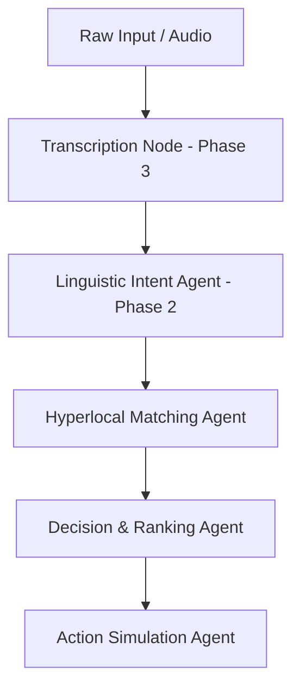

# File: SYSTEM_1_CUSTOMER_BRAIN.md

## Purpose
Document the complete specification and implementation blueprint for System 1: Interaction & Order Intelligence (Customer Brain).

## Responsibility
Guide developers on building, testing, and integrating the multi-lingual parsing, hyperlocal matching, agent ranking, and mock order booking components of the Opsify platform.

## Inputs
Raw voice notes or multilingual text messages (English, Urdu script, Roman Urdu).

## Outputs
Structured order JSON event (`CUSTOMER_ORDER_BOOKED`), trace logs, and provider booking status.

## Dependencies
- tools/database.py
- tools/booking.py

## Notes
Employs a sequential State-Graph (Blackboard) pipeline to ensure progressive state modification and logging.

---

# 📥 System 1: Interaction & Order Intelligence (Customer Brain)

The **Customer Brain** handles everything coming from customers, transforming messy human communications (English, Urdu, Roman Urdu, or raw audio voice files) into clean business data.

---

## 🏗️ 1. Architecture Pipeline & Core Flow



The pipeline operates sequentially as a State-Graph, updating the central `OpsifyState` Blackboard object:
1.  **Ingestion:** Accept text inputs or transcribe raw `.wav`/`.m4a` files into text using Whisper.
2.  **Intent Parsing:** Parse key metrics: `category`, `location`, `time`, `quantity`, and `urgency`.
3.  **Matching:** Query hyperlocal pools of service providers or commodity providers.
4.  **Ranking:** Score matches based on a balance of ratings and price, creating an AI reasoning string.
5.  **Simulation:** Reserve the technician/provider and emit an integration event.

---

## 🛠️ 2. The 3 Phased Development Milestones

### 📍 Phase 1: Heuristic Scaffolding (Current MVP)
*   **Goal:** Build the State-Graph skeleton and implement basic keyword matching to test transitions.
*   **Details:** Runs local pattern checks on string inputs (e.g. mapping "bijli", "electrician" ➔ Electrician). Uses mock databases to output successful trace logs.

### 📍 Phase 2: Live Multilingual LLM Integration
*   **Goal:** Connect standard LLM APIs to handle complex, typo-heavy Roman Urdu inputs.
*   **Prompt Specification:**
    ```text
    Extract the following attributes as JSON from this client request:
    - category: Choose from ["Electrician", "Plumber", "AC Technician", "Milk", "General Help"]
    - location: Map to one of ["Gulshan", "DHA", "Clifton"]
    - time: Exact time slot or "ASAP"
    - quantity: Volume metrics (e.g., "2kg"), default to null.
    - urgency_level: High if keywords like "urgent", "emergency", "fauri" exist, else Medium/Low.
    ```

### 📍 Phase 3: Multimodal Audio Transcription
*   **Goal:** Ingest binary audio note uploads from chat interfaces (like WhatsApp voice messages).
*   **Details:** Integrate a Faster-Whisper or Whisper API transcription node at the start of the graph pipeline to transcribe voice notes into raw text inputs.

---

## 📊 3. Central State Schema & Event Output (API Contract)

### 3.1 State Schema Definition (`orchestrator/state.py`):
```python
class OpsifyState(TypedDict):
    raw_input: str
    extracted_intent: Dict[str, Any]  # {"category": str, "location": str, "time": str, "quantity": str}
    candidate_providers: List[Dict[str, Any]]
    selected_provider: Dict[str, Any]
    agent_trace_logs: List[str]       # Live thought logs parsed by Flutter UI
    execution_status: str             # "PENDING", "PARSED", "MATCHED", "BOOKED", "FAILED"
```

### 3.2 Output Event Contract (`CUSTOMER_ORDER_BOOKED`):
```json
{
  "event_type": "CUSTOMER_ORDER_BOOKED",
  "source": "CustomerBrain",
  "timestamp": "ISO-8601",
  "payload": {
    "order_id": "ORD-771F",
    "category": "Electrician",
    "location": "Gulshan",
    "provider_id": "p1",
    "price": 1000,
    "urgency": "MEDIUM",
    "time": "Tomorrow"
  }
}
```

---

## 🧪 4. Standalone Testing Guide
Your module can be developed and validated completely in isolation from the other Brains.

1.  **Configure Environment:** Check dependencies in `requirements.txt`.
2.  **Run Validation Check:** Run the built-in terminal pipeline testing script:
    ```bash
    python test_graph.py
    ```
3.  **Inspect Results:** Verify that the console prints each agent node transition, tool call, and the finalized booked package reasoning history without errors.
