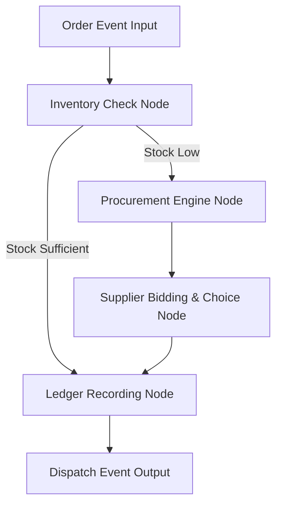

# File: SYSTEM_2_COMPANY_BRAIN.md

## Purpose
Document the complete specification and implementation blueprint for System 2: Business Operations (Company Brain).

## Responsibility
Guide developers on building, testing, and integrating the stock-checking, wholesales automated supplier bidding, ledger-calculation, and persistent database logic.

## Inputs
Confirmed order events from Customer Brain (`CUSTOMER_ORDER_BOOKED`).

## Outputs
Dispatched order JSON events (`BUSINESS_DISPATCH_CONFIRMED`), ledger logs, and dynamic procurement status.

## Dependencies
None (isolated package layer).

## Notes
Decoupled rules engine allowing business operators to automate replenishment thresholds and compare wholesale prices dynamically.

---

# 📦 System 2: Business Operations (Company Brain)

The **Company Brain** acts as the digital manager running business operations 24/7. It dynamically handles stock allocations, evaluates external supplier prices, and manages financial accounting ledger logs.

---

## 🏗️ 1. Architecture Pipeline & Core Flow



1.  **Stock Verification:** Differentiate between physical products (commodities like Milk) and hourly labors (services like Electricians). Services are assumed to have infinite availability.
2.  **Procurement Trigger:** If physical commodity quantity drops below thresholds, automatically trigger wholesale price bidding.
3.  **Bidding Calculations:** Query mock wholesale APIs, evaluate pricing/duration factors, and select the optimal vendor.
4.  **Financial Accounting:** Update ledger logs: calculate final revenue, cost adjustments, and margins.

---

## 🛠️ 2. The 3 Phased Development Milestones

### 📍 Phase 1: In-Memory Rules & Replenishment Thresholds (Current Sprint)
*   **Goal:** Scaffolding the company graph operations using local memory dictionaries.
*   **Details:** If Milk inventory stock < 5, trigger `procurement_needed: True`. Mock supplier pricing quotes using raw JSON profiles.

### 📍 Phase 2: Supabase/PostgreSQL Database Integrations
*   **Goal:** Hook up a persistent database to handle real stock status and live wholesales.
*   **Details:** Integrate SQL tables for:
    *   `Inventory` (item_id, item_name, current_stock, reorder_limit)
    *   `Ledger` (transaction_id, cost, revenue, profit, recorded_at)
    *   Query live local price APIs rather than hardcoded mock dictionaries.

### 📍 Phase 3: ML Demand Forecasting
*   **Goal:** Predict inventory shortages and auto-procure ahead of demand spikes.
*   **Details:** Train a lightweight regression model analyzing sales history logs to predict weekend hot spikes and place purchase orders 24 hours in advance.

---

## 📊 3. Core Bidding Algorithms & Event Payload

### 3.1 Wholesaler Decision Algorithm
When a commodity reorder trigger fires, candidate bids are scored using urgency parameters:
*   **Case A (Urgency = HIGH):** Prioritize fast dispatch speeds:
    $$\text{Selected Wholesaler} = \min(\text{delivery\_time\_hrs})$$
*   **Case B (Urgency = LOW/MEDIUM):** Prioritize lowest unit prices:
    $$\text{Selected Wholesaler} = \min(\text{price\_per\_unit})$$

### 3.2 Output Event Contract (`BUSINESS_DISPATCH_CONFIRMED`):
```json
{
  "event_type": "BUSINESS_DISPATCH_CONFIRMED",
  "source": "CompanyBrain",
  "timestamp": "ISO-8601",
  "payload": {
    "order_id": "ORD-771F",
    "item": "Electrician",
    "provider_id": "p1",
    "dispatch_status": "READY",
    "profit_margin": 200.0
  }
}
```

---

## 🧪 4. Standalone Testing Guide
You do not need System 1 or System 3 finished to build this brain.

1.  **Create mock inputs:** Create a test file `test_company.py`.
2.  **Stub inputs:** Hardcode fake customer order JSON payloads matching the System 1 contract.
3.  **Run logic:** Execute the company graph engine, and assert that:
    *   Order costs reduce inventory amounts.
    *   Under-stock cases trigger bid processes.
    *   Final ledger logs record the correct net profit.
