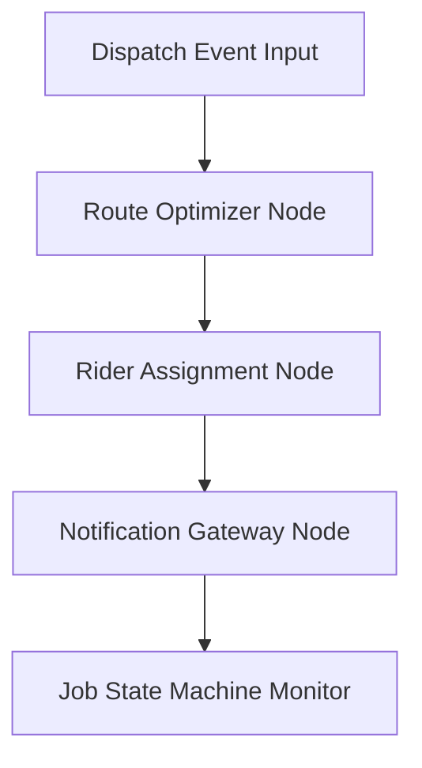

# File: SYSTEM_3_ACTION_BRAIN.md

## Purpose
Document the complete specification and implementation blueprint for System 3: Logistics & Execution (Action Brain).

## Responsibility
Guide developers on building, testing, and integrating the geographic routing, rider assignments, notification gateways, and live job state trackers.

## Inputs
Confirmed dispatch events from Company Brain (`BUSINESS_DISPATCH_CONFIRMED`).

## Outputs
Twilio/WhatsApp message triggers, en-route coordinate steps, and dynamic ETAs.

## Dependencies
None (isolated routing module).

## Notes
Monitors execution steps dynamically, updating status arrays sequentially across active coordinate maps.

---

# 🚚 System 3: Logistics & Execution (Action Brain)

The **Action Brain** turns digital operational decisions into real-world action—dispatching riders, optimizing routes, and triggering client SMS notifications.

---

## 🏗️ 1. Architecture Pipeline & Core Flow



1.  **Route Calculations:** Map destination boundaries and calculate optimal path arrays.
2.  **Regional Allocation:** Search active courier directories and select the closest rider matching the regional zone.
3.  **Notification Gateway:** Draft customized WhatsApp/SMS payloads en route.
4.  **Job Tracking:** Run state machine updates:
    ```text
    [DISPATCHED] ➔ [EN_ROUTE] ➔ [ARRIVED] ➔ [JOB_STARTED] ➔ [JOB_COMPLETED]
    ```

---

## 🛠️ 2. The 3 Phased Development Milestones

### 📍 Phase 1: Booking & SMS Simulation (Current Sprint)
*   **Goal:** Stand up the logistics graph pipeline using local coordinates.
*   **Details:** Maps target zones (DHA, Gulshan, Clifton) to simple local rider telemetry arrays. Output simulated print notifications.

### 📍 Phase 2: Live Geolocation Routing APIs
*   **Goal:** Enable optimized path-finding algorithms.
*   **Details:** Integrate distance matrix tools (OSRM, Mapbox, or Google Maps Distance Matrix API) to calculate realistic vehicle transit ETAs and minimize fuel consumption.

### 📍 Phase 3: Live Gateways & Payout Sandboxes
*   **Goal:** Hook logistics events to real-world communication and payment APIs.
*   **Details:** Connect Twilio WhatsApp APIs for real customer text alerts containing live GPS tracking links. Trigger automated payouts (Stripe/JazzCash) to contractors on task completions.

---

## 📊 3. Rider Allocation & Job State Payload

### 3.1 Rider Allocation Zoning logic
Active workers are partitioned by geographic coordinates:
*   *Gulshan Depot:* Assigned to regional rider pool A.
*   *DHA/Clifton Depot:* Assigned to regional rider pool B.
*   Assignments occur by computing direct zone checks or computing minimum Haversine distance paths.

### 3.2 Output Alert Payload Example (WhatsApp Integration):
```json
{
  "order_id": "ORD-771F",
  "customer_phone": "+923001234567",
  "message": "Hi Customer, technician Ali Electrician is en-route. ETA is 18 mins. Track live: http://opsify.ly/track/771F"
}
```

---

## 🧪 4. Standalone Testing Guide
Build and verify System 3 completely in isolation.

1.  **Create mock inputs:** Setup a test script `test_action.py`.
2.  **Stub inputs:** Hardcode dispatch events matching the System 2 contract.
3.  **Run validation:** Fire the logistics state graph and assert that:
    *   Correct rider pools are checked.
    *   Notification arrays log successful simulated alert strings.
    *   State status transitions safely from `DISPATCHED` to `JOB_COMPLETED`.
